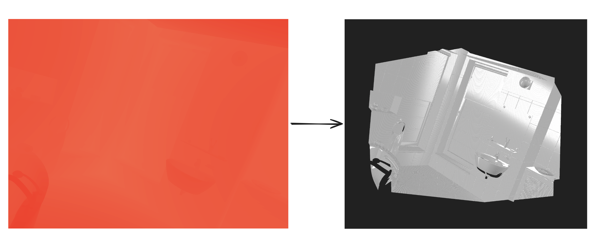

`depthmesh` is a cli tool that re-generates a mesh from a depth image.



## Build

```shell
git clone https://github.com/levinion/depthmesh
cd depthmesh
cargo install --path .
```

## Usage

```txt
Usage: depthmesh [OPTIONS] --depth <DEPTH> --output <OUTPUT> --intrinsic <INTRINSIC>

Options:
  -d, --depth <DEPTH>
  -o, --output <OUTPUT>
  -n, --normal <NORMAL>
  -a, --albedo <ALBEDO>
  -O, --opacity <OPACITY>
  -r, --roughness <ROUGHNESS>
  -m, --metallic <METALLIC>
  -t, --threshold <THRESHOLD>      [default: 0.1]
  -i, --intrinsic <INTRINSIC>
      --source-pose <SOURCE_POSE>
      --target-pose <TARGET_POSE>
      --offset <OFFSET>            [default: 0]
  -s, --scale <SCALE>              [default: 1]
      --reverse-z
  -D, --distance
      --optimize
      --reduction <REDUCTION>      [default: 0.1]
      --error <ERROR>              [default: 0.01]
      --smooth
      --lambda <LAMBDA>            [default: 0.1]
      --iterations <ITERATIONS>    [default: 10]
  -h, --help                       Print help
  -V, --version                    Print version
```

### Example

```shell
depthmesh -d depth.exr -n normal.exr -i $(INTRINSIC) -o mesh.ply --optimize --smooth 
```

See https://github.com/levinion/depthmesh/tree/main/examples for more.

### Issue

- The input image can only be RGB image. If an image contains non-RGB channel such as 'Z' or 'Y', should convert it to 'R' instead. You can use `oiiotool` to do that:

```shell
oiiotool input.exr --ch R=Y,G=0,B=0 -o output.exr
```
